# OpenID4VP

## OpenID4VP - Online Sharing

This library enables consumer applications (mobile wallet) to share users Verifiable Credentials with Verifiers who request them online. It adheres to the OpenID4VP [specification](https://openid.net/specs/openid-4-verifiable-presentations-1_0-21.html) which outlines the standards for requesting and presenting Verifiable Credentials.

#### Library Functionalities: Processing the Request from Decoding to Verifier Response

1. Receives the Verifier's Authorization Request sent by the consumer application (mobile wallet).
2. Authenticates the Verifier using the received **client\_id** and validates the whole Request to check if the required details are present or not and then returns the Authorization Request to the consumer application if all the validations are successful.
3. Receives the list of Verifiable Credentials from the consumer application which are selected by the consumer application end-user based on the credentials requested as part of Verifier Authorization request.
4. Constructs the vp\_token without proof section and sends it back to the consumer application for generating Json Web Signature (JWS).
5. Receives the generated signature along with the other details and generates vp\_token with proof section & presentation\_submission.
6. Sends a POST request with generated vp\_token and presentation\_submission to the received Verifier's response\_uri endpoint.
7. Below sections details on the steps for integrating the Kotlin and Swift packages into the app. Below sections details on the steps for integrating the Kotlin and Swift packages into the app.

### Android: Kotlin package for OpenID4VP:

#### Repository

* inji-openid4vp kotlin repo - [here](https://github.com/mosip/inji-openid4vp)

#### Installation

Snapshot builds are available [here](https://oss.sonatype.org/content/repositories/snapshots/io/mosip/inji-openid4vp/).


Note: implementation "io.mosip:inji-openID4VP:0.1.0-SNAPSHOT"


#### Create instance of OpenID4VP library to invoke its methods

val openID4VP = OpenID4VP("test-OpenID4VP")

#### APIs

Below are the APIs provided by this library:

**1. authenticateVerifier**

* Receives a list of trusted verifiers & Verifier's encoded Authorization request from consumer app(mobile wallet).
* Decodes and parse the request, extracts the clientId and verifies it against trusted verifier's list clientId.
* Returns the Authentication response which contains validated Presentation Definition of the Authorization request.

```
 val authenticationResponse = openID4VP.authenticateVerifier(encodedAuthenticationRequest: String, trustedVerifierJSON: List<Verifier>)
```

**Parameters**

| Name                         | Type   | Description                                                                          | Sample                                                                                     |
| ---------------------------- | ------ | ------------------------------------------------------------------------------------ | ------------------------------------------------------------------------------------------ |
| encodedAuthenticationRequest | String | Base64 encoded string containing the Verifier's authorization request                | `"T1BFTklENFZQOi8vYXV0"`                                                                   |
| trustedVerifiers             | List   | A list of trusted Verifier objects each containing a clientId and a responseUri list | `listOf(Verifier("https://verify.env1.net",listOf("https://verify.env1.net/responseUri"))` |

**Exceptions**

1. DecodingException is thrown when there is an issue while decoding the Authorization Request
2. InvalidQueryParams exception is thrown if
   * query params are not present in the Request
   * there is an issue while extracting the params
   * both presentation\_definition and presentation\_definition\_uri are present in Request
   * both presentation\_definition and presentation\_definition\_uri are not present in Request
3. MissingInput exception is thrown if any of required params are not present in Request
4. InvalidInput exception is thrown if any of required params value is empty or null
5. InvalidVerifierClientID exception is thrown if the received request client\_iD & response\_uri are not matching with any of the trusted verifiers This method will also notify the Verifier about the error by sending it to the response\_uri endpoint over http post request. If response\_uri is invalid and validation failed then Verifier won't be able to know about it.

**2. constructVerifiablePresentation**

* Receives a map of input\_descriptor id & list of verifiable credentials for each input\_descriptor that are selected by the end-user.
* Creates a vp\_token without proof using received input\_descriptor IDs and verifiable credentials, then returns its string representation to consumer app(mobile wallet) for signing it.

```
    val vpTokenWithoutProof = openID4VP.constructVerifiablePresentation(verifiableCredentials: Map<String, List<String>>)
```

**Parameters**

| Name                  | Type               | Description                                                                                                      | Sample                                   |
| --------------------- | ------------------ | ---------------------------------------------------------------------------------------------------------------- | ---------------------------------------- |
| verifiableCredentials | Map\<String, List> | A Map which contains input descriptor id as key and corresponding matching Verifiable Credentials list as value. | `mapOf("id_123" to listOf("vc1","vc2"))` |

**Exceptions**

1. JsonEncodingFailed exception is thrown if there is any issue while serializing the vp\_token without proof. This method will also notify the Verifier about the error by sending it to the response\_uri endpoint over http post request. If response\_uri is invalid and validation failed then Verifier won't be able to know about it.

**3. shareVerifiablePresentation**

* This function constructs a vp\_token with proof using received VPResponseMetadata, then sends it and the presentation\_submission to the Verifier via a HTTP POST request.
* Returns the response back to the consumer app(mobile app) saying whether it has received the shared Verifiable Credentials or not.

```
    val response = openID4VP.shareVerifiablePresentation(vpResponseMetadata: VPResponseMetadata)
```

**Parameters**

| Name               | Type               | Description                                                                             | Sample                                                                                                                                                             |
| ------------------ | ------------------ | --------------------------------------------------------------------------------------- | ------------------------------------------------------------------------------------------------------------------------------------------------------------------ |
| vpResponseMetadata | VPResponseMetadata | This contains domain & proof details such as jws, signatureAlgorithm, publicKey, domain | `VPResponseMetadata(jws = "eyJiweyrtwegrfwwaBKCGSwxjpa5suaMtgnQ",signatureAlgorithm = "RsaSignature2018",publicKey = "publicKey",domain = "https://domain.net")")` |

**Exceptions**

1. JsonEncodingFailed exception is thrown if there is any issue while serializing the generating vp\_token or presentation\_submission class instances.
2. InterruptedIOException is thrown if the connection is timed out when network call is made.
3. NetworkRequestFailed exception is thrown when there is any other exception occurred when sending the response over http post request. This method will also notify the Verifier about the error by sending it to the response\_uri endpoint over http post request. If response\_uri is invalid and validation failed then Verifier won't be able to know about it.

**4. sendErrorToVerifier**

* Receives an exception and sends its message to the Verifier via an HTTP POST request.

```
 openID4VP.sendErrorToVerifier(exception: Exception)
```

**Parameters**

| Name      | Type      | Description                        | Sample                               |
| --------- | --------- | ---------------------------------- | ------------------------------------ |
| exception | Exception | This contains the exception object | `new Exception("exception message")` |

**Exceptions**

1. InterruptedIOException is thrown if the connection is timed out when network call is made.
2. NetworkRequestFailed exception is thrown when there is any other exception occurred when sending the response over http post request.

### iOS: Swift package for OpenID4VP:

#### Repository

* inji-openid4vp-ios-swift swift repo -> [here](https://github.com/mosip/inji-openid4vp-ios-swift)

#### Installation

1. Clone the repo.
2. In your swift application go to file > add package dependency > add the https://github.com/mosip/inji-openid4vp-ios-swift in git search bar > add package.
3. Import the library and use.

#### Create instance of OpenID4VP library to invoke its methods

let openID4VP = OpenID4VP(traceabilityId: "AXESWSAW123", networkManager: NetworkManager)

#### APIs

**1. authenticateVerifier**

* Receives a list of trusted verifiers & Verifier's encoded Authorization request from consumer app(mobile wallet).
* Decodes and parse the request, extracts the clientId and verifies it against trusted verifier's list clientId.
* Returns the Authentication response which contains validated Presentation Definition of the Authorization request.

```
let response = try authenticateVerifier(encodedAuthorizationRequest: String, trustedVerifierJSON: [Verifier])
```

**Parameters**

| Name                        | Type        | Description                                                                          | Sample                                                 |
| --------------------------- | ----------- | ------------------------------------------------------------------------------------ | ------------------------------------------------------ |
| encodedAuthorizationRequest | String      | Base64 encoded string containing the Verifier's authorization request                | `"T1BFTklENFZQOi8vYXV0"`                               |
| trustedVerifierJSON         | \[Verifier] | A list of trusted Verifier objects each containing a clientId and a responseUri list | `[Verifier(clientId: String, responseUris: [String])]` |

**Exceptions**

1. DecodingException is thrown when there is an issue while decoding the Authorization Request
2. InvalidQueryParams exception is thrown if
   * query params are not present in the Request
   * there is an issue while extracting the params
   * both presentation\_definition and presentation\_definition\_uri are present in Request
   * both presentation\_definition and presentation\_definition\_uri are not present in Request
3. MissingInput exception is thrown if any of required params are not present in Request
4. InvalidInput exception is thrown if any of required params value is empty or null
5. InvalidVerifierClientID exception is thrown if the received request client\_iD & response\_uri are not matching with any of the trusted verifiers This method will also notify the Verifier about the error by sending it to the response\_uri endpoint over http post request. If response\_uri is invalid and validation failed then Verifier won't be able to know about it.

**2. constructVerifiablePresentation**

* Receives a map of input\_descriptor id & list of verifiable credentials for each input\_descriptor that are selected by the end-user.
* Creates a vp\_token without proof using received input\_descriptor IDs and verifiable credentials, then returns its string representation to consumer app(mobile wallet) for signing it.

```
    let response = try openID4VP.constructVerifiablePresentation(credentialsMap: [String: [String]])
```

**Parameters**

| Name           | Type                 | Description                                                                                                     | Sample                         |
| -------------- | -------------------- | --------------------------------------------------------------------------------------------------------------- | ------------------------------ |
| credentialsMap | \[String: \[String]] | A Map which contains input descriptor id as key and corresponding matching Verifiable Credentials list as value | `["bank_input":["VC1","VC2"]]` |

**Exceptions**

1. JsonEncodingFailed exception is thrown if there is any issue while serializing the vp\_token without proof. This method will also notify the Verifier about the error by sending it to the response\_uri endpoint over http post request. If response\_uri is invalid and validation failed then Verifier won't be able to know about it.

**3. shareVerifiablePresentation**

* This function constructs a vp\_token with proof using received VPResponseMetadata, then sends it and the presentation\_submission to the Verifier via a HTTP POST request.
* Returns the response back to the consumer app(mobile app) saying whether it has received the shared Verifiable Credentials or not.

```
    let response = try await openID4VP.shareVerifiablePresentation(vpResponseMetadata: VPResponseMetadata)
```

**Parameters**

| Name               | Type               | Description                                                                             | Sample                                                                                                              |
| ------------------ | ------------------ | --------------------------------------------------------------------------------------- | ------------------------------------------------------------------------------------------------------------------- |
| vpResponseMetadata | VPResponseMetadata | This contains domain & proof details such as jws, signatureAlgorithm, publicKey, domain | `VPResponseMetadata(jws: "jws", signatureAlgorithm: "signatureAlgoType", publicKey: "publicKey", domain: "domain")` |

**Exceptions**

1. JsonEncodingFailed exception is thrown if there is any issue while serializing the generating vp\_token or presentation\_submission class instances.
2. InterruptedIOException is thrown if the connection is timed out when network call is made.
3. NetworkRequestFailed exception is thrown when there is any other exception occurred when sending the response over http post request. This method will also notify the Verifier about the error by sending it to the response\_uri endpoint over http post request. If response\_uri is invalid and validation failed then Verifier won't be able to know about it.

**4. sendErrorToVerifier**

* Receives an exception and sends its message to the Verifier via an HTTP POST request.

```
 openID4VP.sendErrorToVerifier(error: Error)
```

**Parameters**

| Name  | Type  | Description                        | Sample                                                                            |
| ----- | ----- | ---------------------------------- | --------------------------------------------------------------------------------- |
| error | Error | This contains the exception object | `AuthorizationConsent.consentRejectedError(message: "User rejected the consent")` |

**Exceptions**

1. InterruptedIOException is thrown if the connection is timed out when network call is made.
2. NetworkRequestFailed exception is thrown when there is any other exception occurred when sending the response over http post request.

#### OpenID4VP library and Inji Wallet integration:

The below diagram shows the interactions between Inji Wallet, Verifier and OpenID4VP library.

```mermaid
sequenceDiagram
    participant Verifier as 🔍 Verifier
    participant Wallet as 📱 Wallet
    participant Library as 📚 Native Library
    
    Note over Verifier: Generate QR Code with<br/>Authorization Request
    Wallet -->> Verifier: Scan QR Code
    Wallet -->> Library: Forward Authorization Request

    activate Library
    Note over Library: Validate Request against:<br/>1. Client ID<br/>2. Response URI<br/>3. Trusted Verifiers
    Note over Library: Validate Required Fields<br/>and Values
    deactivate Library
    Library-->>Wallet: Return Validated Authorization
    

    activate Wallet
    Note over Wallet: Display Matching VCs<br/>to User
    deactivate Wallet
    
    Wallet-->>Library: Send Selected VCs<br/>with User Consent
    Library-->>Library: Construct VP Token
    Library-->>Wallet: Return VP Token
    
    activate Wallet
    Note over Wallet: Sign VP Token
    Note over Wallet: Construct JWS Token
    deactivate Wallet
    Wallet-->>Library: Send Signed JWS Token
    
    activate Library
    Note over Library: Construct Proof Object
    Note over Library: Attach Proof to VP Token
    deactivate Library
    
    Library-->>Verifier: HTTP POST Request with:<br/>1. VP Token<br/>2. Presentation Submission<br/>3. State

```




